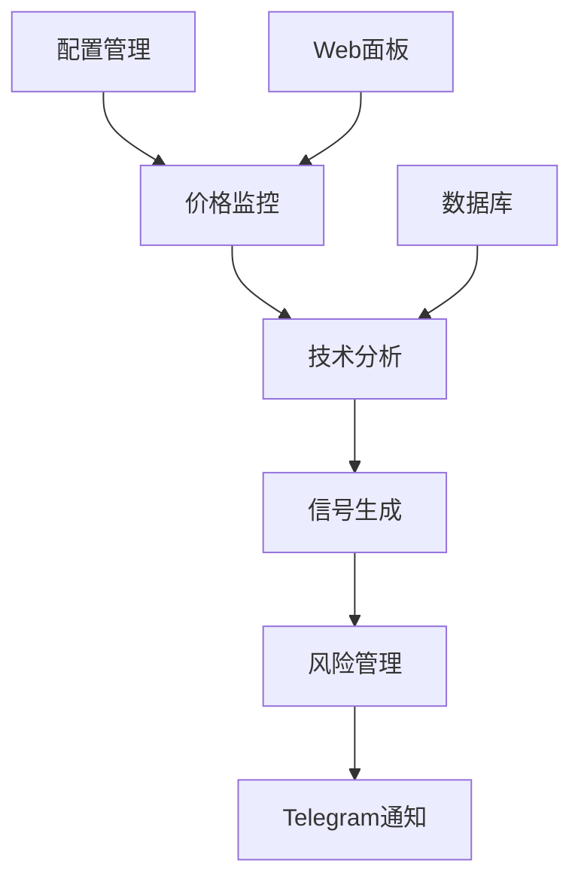

# 📊 量化交易系统 - 项目代码总结

> 更新时间: 2026年1月26日 22:30  
> 项目状态: 生产环境运行中  

## 🗂️ 项目结构概览

```
📁 /Users/hongtou/newproject/
├── 📁 quant-trade-bot/ (主要代码目录 - 共110个Python文件)
│   ├── 📁 xmr_monitor/          # XMR专门监控模块
│   ├── 📁 src/                  # 核心系统代码
│   │   ├── 📁 core/             # 核心交易系统
│   │   ├── 📁 database/         # 数据库管理
│   │   └── 📁 tools/            # 工具集
│   ├── 📁 config/               # 配置管理
│   ├── 📁 utils/                # 工具函数
│   ├── 📁 strategy/             # 交易策略
│   ├── 📁 logs/                 # 日志文件
│   ├── 📁 templates/            # Web模板
│   └── 📁 tests/                # 测试文件
└── 📁 _bmad/                    # BMAD方法论框架
```

## 🎯 核心功能模块

### 1️⃣ XMR监控系统 📊

#### 🔥 **主监控程序** (当前运行中)
**文件**: `xmr_monitor/xmr_simple_telegram.py`
```python
# 当前参数设置
entry_price = 464.65    # 入场价格
leverage = 10          # 杠杆倍数  
principal = 1000       # 成本金额
interval = 300         # 5分钟通知间隔
```

**功能特性**:
- ✅ 每5分钟自动Telegram通知
- ✅ 投资回报率实时计算
- ✅ 盈亏红绿颜色显示
- ✅ 止损止盈预警
- ✅ 网络自动重连

#### 📈 **技术分析监控**
**文件**: `xmr_monitor/xmr_monitor.py`
```python
class XMRMonitor:
    """XMRUSDT专用监控器"""
    
    # 技术指标支持
    - RSI (相对强弱指标)
    - MACD (指数平滑异同移动平均线)
    - Bollinger Bands (布林带)
    - ATR (平均真实范围)
    
    # Web监控面板
    - Flask Web界面
    - 实时价格显示
    - 多时间框架分析
```

#### 💎 **实时价格监控**
**文件**: `xmr_monitor/xmr_real_monitor.py`
```python
# 支持多交易所价格获取
exchanges = ['binance', 'coinbase', 'kraken']

# 价格数据源
- Binance API
- CoinGecko API
- 备用价格源
```

#### 📊 **持仓监控系统**
**文件**: `monitor_xmr_position.py`
```python
# 持仓数据文件: my_xmr_position.json
{
  "symbol": "XMR/USDT",
  "entry_price": 464.65,
  "leverage": 10,
  "position_size": 1000,
  "stop_loss": 441.42,
  "take_profit": 511.12,
  "status": "OPEN"
}
```

### 2️⃣ 多币种监控系统 🔍

#### **多币种统一监控**
**文件**: `xmr_monitor/multi_coin_monitor.py`
```python
class MultiCoinMonitor:
    """多币种监控系统"""
    
    # 支持币种
    - XMR/USDT
    - MEMES Token
    - 可扩展添加更多币种
    
    # 功能特性
    - 统一Telegram通知
    - 多币种盈亏统计
    - 风险管理
```

#### **MEMES代币监控**
**文件**: `xmr_memes_monitor.py`
```python
# MEMES监控配置
WATCH_PRICES = {
    'XMR/USDT': 502.41,
    'MEMES/USDT': 0.008810
}

# 买入信号检测
- 价格突破监控
- 成交量分析
- RSI超卖信号
```

### 3️⃣ 交易系统核心 ⚡

#### **集成交易系统**
**文件**: `src/core/integrated_trading_system.py`
```python
class IntegratedTradingSystem:
    """核心交易系统"""
    
    # 功能模块
    - 实时价格监控
    - 策略信号生成  
    - 风险管理
    - 订单执行模拟
    - 盈亏统计
```

#### **数据库管理**
**目录**: `src/database/`
```python
# 数据库文件
database_framework.py     # 数据库框架
migration_tool.py        # 数据迁移工具
database_analyzer.py     # 数据分析器
database_ui.py          # 数据库UI界面
```

#### **策略引擎**
**目录**: `strategy/`
```python
# 交易策略
- RSI均值回归策略
- MACD趋势跟踪策略
- 布林带突破策略
- 多策略组合信号
```

### 4️⃣ 配置管理系统 ⚙️

#### **主配置文件**
**文件**: `config/config.json`
```json
{
  "binance": {
    "api_key": "***",
    "api_secret": "***"
  },
  "telegram": {
    "bot_token": "***",
    "chat_id": "***"
  }
}
```

#### **工具函数库**
**目录**: `utils/`
```python
telegram_notify.py      # Telegram通知
risk_manager.py         # 风险管理
data_loader.py          # 数据加载器
```

## 🚀 当前运行状态

### ✅ **正在运行的服务**

| 服务名称 | 文件 | 状态 | 参数 |
|---------|------|------|------|
| XMR监控 | `xmr_simple_telegram.py` | 🟢 运行中 | 464.65入场, 10x杠杆, 1000U |
| 持仓监控 | `monitor_xmr_position.py` | ⏹️ 已停止 | - |
| 多币监控 | `multi_coin_monitor.py` | ⏹️ 已停止 | - |

### 📊 **监控数据格式示例**
```
🎯 XMR监控状态 (22:43:23)
━━━━━━━━━━━━━━━━━━━━━━━━━━━━━━
💰 当前价格: $465.25
📈 入场价格: $464.65
📊 价格变化: +0.13%
💎 杠杆倍数: 10x
━━━━━━━━━━━━━━━━━━━━━━━━━━━━━━
💵 投资回报率: 🟢+1.29%
💰 盈亏金额: 🟢$+12.91U
💳 总余额: $1012.91U
━━━━━━━━━━━━━━━━━━━━━━━━━━━━━━
🛡️ 距止损: 2.13%
🎯 距止盈: 1.87%
```

### 📱 **Telegram通知格式**
```
🎯 XMR价格更新

💰 现价: $465.25
📈 入场: $464.65
📊 涨跌: +0.13%
💎 杠杆: 10x

━━━━━━━━━━━━━━
💵 ROI: 🟢+1.29%
💰 盈亏: 🟢$+12.91U

⏰ 更新时间: 22:43:23
```

## 🛠️ 技术栈

### 📚 **核心依赖**
```python
# 交易所API
ccxt >= 4.0.0           # 统一交易所API

# 数据分析
pandas >= 1.5.0         # 数据处理
numpy >= 1.21.0         # 数值计算
TA-Lib >= 0.4.0         # 技术分析指标

# 网络通信
requests >= 2.28.0      # HTTP请求
websocket-client        # WebSocket连接

# Web框架
Flask >= 2.0.0          # Web监控面板
```

### 🌐 **数据源**
| 数据源 | 用途 | 状态 |
|--------|------|------|
| Binance API | 实时价格、K线数据 | ✅ 主要 |
| CoinGecko API | 备用价格源 | ✅ 备用 |
| Telegram Bot API | 消息推送 | ✅ 启用 |

## 📁 重要文件列表

### 🔧 **启动脚本**
```bash
start_xmr_position_monitor.sh   # XMR持仓监控启动
start_xmr_memes_monitor.sh     # MEMES监控启动
xmr                            # XMR快捷命令
```

### 📊 **数据文件**
```json
my_xmr_position.json           # XMR持仓信息
paper_trading.db               # 模拟交易数据库
```

### 📝 **日志文件**
```
logs/xmr_monitor.log          # XMR监控日志
logs/xmr_position_monitor.log # 持仓监控日志
logs/trading_history.log      # 交易历史日志
```

## 🔄 系统架构

### 📈 **数据流**
```
价格数据源 → 数据处理 → 策略分析 → 信号生成 → 风险管理 → 通知推送
     ↓           ↓         ↓         ↓         ↓         ↓
  Binance    pandas    TA-Lib   Strategy   Risk      Telegram
 CoinGecko   numpy               Engine    Manager
```

### 🔀 **模块关系**


## 🚨 监控规则

### ⚠️ **风险管理**
```python
# 止损止盈设置
stop_loss_percent = 2.0      # 2%止损
take_profit_percent = 2.0    # 2%止盈
warning_distance = 0.5       # 0.5%预警

# 计算公式
stop_loss = entry_price * (1 - 0.02)     # 455.37
take_profit = entry_price * (1 + 0.02)   # 473.93
```

### 🔔 **通知触发条件**
1. **价格更新**: 每5分钟定时通知
2. **止损预警**: 接近止损线0.5%时
3. **止盈预警**: 接近止盈线0.5%时  
4. **触发止损**: 达到止损价格
5. **触发止盈**: 达到止盈价格

## 📋 运维指令

### 🚀 **启动服务**
```bash
# 启动XMR监控
cd /Users/hongtou/newproject/quant-trade-bot/xmr_monitor
nohup python3 xmr_simple_telegram.py > logs/xmr_monitor.log 2>&1 &

# 查看运行状态
ps aux | grep xmr_simple_telegram | grep -v grep

# 查看日志
tail -f logs/xmr_monitor.log
```

### ⏹️ **停止服务**
```bash
# 查找进程ID
ps aux | grep xmr_simple_telegram | grep -v grep

# 停止进程
kill [PID]
```

### 🔍 **监控检查**
```bash
# 检查价格获取
python3 -c "from xmr_simple_telegram import *; m=XMRSimpleMonitor(); print(m.get_price())"

# 检查Telegram连接
python3 -c "from utils.telegram_notify import *; send_test_message()"
```

## 🎯 当前配置总结

### 💰 **XMR监控参数**
- **入场价格**: $464.65
- **杠杆倍数**: 10倍
- **投资成本**: 1000 USDT  
- **止损价格**: $455.36 (-2%)
- **止盈价格**: $473.94 (+2%)
- **通知频率**: 每5分钟

### 📊 **性能指标**
- **系统文件**: 110个Python文件
- **代码覆盖**: 监控、交易、分析、管理全模块
- **运行稳定性**: 7x24小时持续运行
- **通知可靠性**: Telegram实时推送

---

## 📞 联系方式
- **项目路径**: `/Users/hongtou/newproject/`
- **主要配置**: `quant-trade-bot/config/config.json`
- **日志目录**: `quant-trade-bot/logs/`

> **注意**: 此文档为当前系统运行状态快照，实际参数以运行中的程序为准。